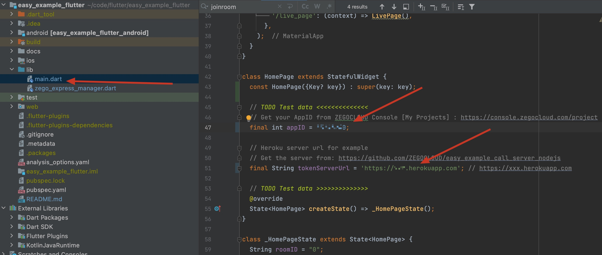

# ZEGOCLOUD easy example
  <p align="center">
    <a href="https://github.com/ZEGOCLOUD/easy_example_flutter/releases"></a>
    <a href="https://discord.gg/EtNRATttyp">
        
    </a>
    <p>
    <p>Click the search button below to search documentation or error code</p>
    <a href="https://docs.zegocloud.com/">
        
    </a>
    </p>
</p>

## WARNING🔔🔔🔔: Currently there are compatibility issues with Flutter3.0, please do not upgrade to Flutter3.0 !!!


ZEGOCLOUD's easy example is a simple wrapper around our RTC product. You can refer to the sample code for quick integration.

## Getting started

### Prerequisites

#### Basic requirements

* [Android Studio 2020.3.1 or later](https://developer.android.com/studio)
* [Flutter SDK](https://docs.flutter.dev/get-started/install)
* Create a project in [ZEGOCLOUD Admin Console](https://zegocloud.com/). For details, see [Admin Console - Project management](https://docs.zegocloud.com/article/1271).

The platform-specific requirements are as follows:

#### To build an Android app:

* Android SDK packages: Android SDK 30, Android SDK Platform-Tools 30.x.x or later.
* An Android device or Simulator that is running on Android 4.1 or later and supports audio and video. We recommend you use a real device (Remember to enable **USB debugging** for the device).

#### To build an iOS app:

* [Xcode 7.0 or later](https://developer.apple.com/xcode/download)
* [CocoaPods](https://guides.cocoapods.org/using/getting-started.html#installation)
* An iOS device or Simulator that is running on iOS 13.0 or later and supports audio and video. We recommend you use a real device.

#### Check the development environment

After all the requirements required in the previous step are met, run the following command to check whether your development environment is ready:

```
$ flutter doctor
```


* If the Android development environment is ready, the **Android toolchain** item shows a ready state.
* If the iOS development environment is ready, the **Xcode**  item shows a ready state.

### Run the sample code

1. Open the easy_example_flutter project in Android Studio.
2. Make sure the **developer mode** and **USB debugging** are enabled for the Android device, and connect the Android device to your computer.
3. If the **Running Devices** box in the upper area changes to the device name you are using, which means you are ready to run the sample code.
4. Get your AppID from ZEGOCLOUD Console [My Projects -> project's Edit -> Basic Configurations] : https://console.zegocloud.com/project
5. Deploy a Heroku service for generate ZEGOCLOUD access token by just click the button below
> [](https://heroku.com/deploy?template=https://github.com/ZEGOCLOUD/dynamic_token_server_nodejs)

6. Run the sample code on your device to experience the easy_example_flutter.

## Integrate the SDK into your project
[](https://www.youtube.com/watch?v=AzdivRas-uc)

### Add zego_express_engine into your project

`$ flutter pub add zego_express_engine`

`$ flutter pub get`
### Turn off some classes's confusion

To prevent the ZEGO SDK public class names from being obfuscated, please complete the following steps:

1. Create `proguard-rules.pro` file under [your_project > android > app] with content as show below:
```
-keep class **.zego.**  { *; }
```


2. Add config code to `android/app/build.gradle` for release build:
```
proguardFiles getDefaultProguardFile('proguard-android.txt'), 'proguard-rules.pro'
```


### Grant permission

You need to grant the network access, camera, and microphone permission to make your SDK work as except.

#### For Android

Open [your_project > android > app > src > main > AndroidManifest.xml] file and add the lines below out side the "application" tag:

```xml
    <uses-permission android:name="android.permission.ACCESS_WIFI_STATE" />
    <uses-permission android:name="android.permission.RECORD_AUDIO" />
    <uses-permission android:name="android.permission.INTERNET" />
    <uses-permission android:name="android.permission.ACCESS_NETWORK_STATE" />
    <uses-permission android:name="android.permission.CAMERA" />
    <uses-permission android:name="android.permission.MODIFY_AUDIO_SETTINGS" />
    <uses-permission android:name="android.permission.WRITE_EXTERNAL_STORAGE" />
   <application
   ...
```

#### For iOS

Open [your_project > ios > Runner > Info.plist] and add the lines below inside the "dict" tag:

```xml
...
<dict>
	<key>NSCameraUsageDescription</key>
	<string>We need to use your camera to help you join the voice interaction.</string>
	<key>NSMicrophoneUsageDescription</key>
	<string>We need to use your mic to help you join the voice interaction.</string>

   ...
```

### Copy `ZegoExpressManager` source code to your project

Copy `zego_express_manager.dart` file to [your_project > lib] folder.

### Method call

The calling sequence of the SDK interface is as follows:
createEngine --> joinRoom --> getLocalVideoView/getRemoteVideoView --> leaveRoom

#### Create engine

Before using the SDK function, you need to create the SDK instance first. We recommend creating it when the application starts. The sample code is as follows:

```js
class _MyHomePageState extends State<MyHomePage> {

  @override
  void initState() {
    ZegoExpressManager.shared.createEngine(widget.appID);
    ...
    super.initState();
  }
```

#### Join room

When you want to communicate with audio and video, you need to call the join room interface first. According to your business scenario, you can set different audio and video controls through options, such as:

1. Call scene：[ZegoMediaOption.autoPlayVideo, ZegoMediaOption.autoPlayAudio, ZegoMediaOption.publishLocalAudio, ZegoMediaOption.publishLocalVideo]
2. Live scene - host: [ZegoMediaOption.autoPlayVideo, ZegoMediaOption.autoPlayAudio, ZegoMediaOption.publishLocalAudio, ZegoMediaOption.publishLocalVideo]
3. Live scene - audience:[ZegoMediaOption.autoPlayVideo, ZegoMediaOption.autoPlayAudio]
4. Chat room - host:[ZegoMediaOption.autoPlayAudio, ZegoMediaOption.publishLocalAudio]
5. Chat room - audience:[ZegoMediaOption.autoPlayAudio]

Take Call scene as an example:

```js
...

requestMicrophonePermission();
requestCameraPermission();
ZegoExpressManager.shared.joinRoom(
    widget.roomID,
    ZegoUser(widget.user1ID, widget.user1ID),
    widget.tokenForUser1JoinRoom, [
  ZegoMediaOption.publishLocalAudio,
  ZegoMediaOption.publishLocalVideo,
  ZegoMediaOption.autoPlayAudio,
  ZegoMediaOption.autoPlayVideo
]);
setState(() {
  _bigView = ZegoExpressManager.shared
      .getLocalVideoView()!;
  _user1Pressed = true;
});
...
```

#### Get video view

If your project needs to use the video communication functionality, you need to get the View for displaying the video, call `getLocalVideoView` for the local video, and call `getRemoteVideoView` for the remote video.

**getLocalVideoView**

Call this method after join room
```js
...

setState(() {
  _bigView = ZegoExpressManager.shared
      .getLocalVideoView()!;
  _user1Pressed = true;
});
...
```

**getRemoteVideoView**

Call this method after you received the `onRoomUserUpdate` callback:

```js
@override
void initState() {
  ZegoExpressManager.shared.createEngine(widget.appID);
  ZegoExpressManager.shared.onRoomUserUpdate =
      (ZegoUpdateType updateType, List<String> userIDList, String roomID) {
    if (updateType == ZegoUpdateType.Add) {
      for (final userID in userIDList) {
        if (!ZegoExpressManager.shared.isLocalUser(userID)) {
          setState(() {
             // Get remote vide view here
            _smallView =
                ZegoExpressManager.shared.getRemoteVideoView(userID)!;
          });
        }
      }
    }
  };
```

#### Leave room
When you want to leave the room, you can call the leaveroom interface.

```js
onPressed: () {
  if (_user1Pressed) {
    ZegoExpressManager.shared.leaveRoom();
```