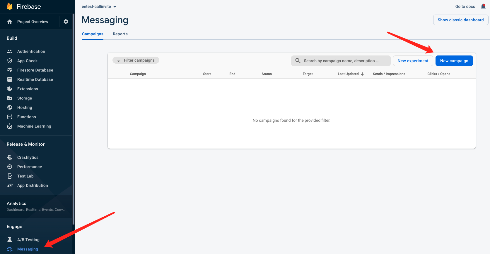
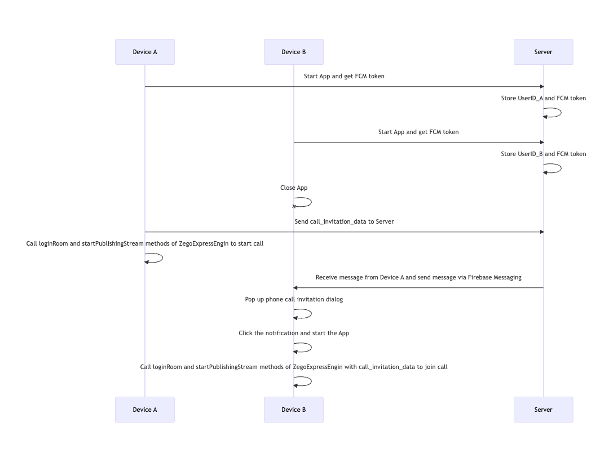

# ZEGOCLOUD easy example

ZEGOCLOUD's easy example is a simple wrapper around our RTC product. You can refer to the sample code for quick integration.

## Getting started

### Prerequisites

#### Basic requirements

* [Android Studio 2020.3.1 or later](https://developer.android.com/studio)
* [Flutter SDK](https://docs.flutter.dev/get-started/install)
* Create a project in [ZEGOCLOUD Admin Console](https://zegocloud.com/). For details, see [Admin Console - Project management](https://docs.zegocloud.com/article/1271).

The platform-specific requirements are as follows:

#### To build an Android app:

* Android SDK packages: Android SDK 30, Android SDK Platform-Tools 30.x.x or later.
* An Android device or Simulator that is running on Android 4.1 or later and supports audio and video. We recommend you use a real device (Remember to enable **USB debugging** for the device).

#### To build an iOS app:

* [Xcode 7.0 or later](https://developer.apple.com/xcode/download)
* [CocoaPods](https://guides.cocoapods.org/using/getting-started.html#installation)
* An iOS device or Simulator that is running on iOS 13.0 or later and supports audio and video. We recommend you use a real device.

#### Check the development environment

After all the requirements required in the previous step are met, run the following command to check whether your development environment is ready:

```
$ flutter doctor
```


* If the Android development environment is ready, the **Android toolchain** item shows a ready state.
* If the iOS development environment is ready, the **Xcode**  item shows a ready state.

#### Check firebase development environment

Install firebase and flutterfire command line tools according to [this document](https://firebase.google.com/docs/flutter/setup)

So that you can execute the following command in the next step

```
firebase login
flutterfire configure
```

#### Modify the project configurations

* You need to set `appID` to your own account, which can be obtained in the [ZEGO Admin Console](https://console.zegocloud.com/).
* You need to set `serverUrl` to a valid URL that can be obtained for Zego auth token and post FCM notification request.

> We use Vecel for test backen service, you can deploy the token generation service with one simple click.
>
> [](https://vercel.com/new/clone?repository-url=https%3A%2F%2Fgithub.com%2FZEGOCLOUD%2Feasy_server_nextjs&env=ZEGOCLOUD_APP_ID,ZEGOCLOUD_SERVER_SECRET,FA_PROJECT_ID,FA_PRIVATE_KEY_ID,FA_PRIVATE_KEY,FA_CLIENT_EMAIL,FA_CLIENT_ID,FA_CLIENT_X509_CERT_URL)
>
> Once deployed completed, you will get an url for your instance, try accessing `https://your_vercel_project_name.vercel.app/api/get_access_token?uid=123` to check if it works.
>
> Check [easy_server_nextjs](https://github.com/ZEGOCLOUD/easy_server_nextjs) for more details.
>


### Run the sample code

1. Open Terminal, navigate to the `easy_example_flutter` folder.
2. Run the `flutter pub get` command to fetch all dependencies that are needed.
3. Run the `firebase login` to connect your firebase account
4. Run the `flutterfire configure` Select your firebase project and configure android and ios project.
5. The ios project needs to configure your development team in xcode and upload the apns certificate to the fcm console of firebase, refer to [this document](https://firebase.flutter.dev/docs/messaging/apple-integration)
6. Run the `flutter run`, sample code will run on your device.

> tips: Android devices need to ensure that the user agrees to the appropriate notification permissions.

> Warning: If you are using flutter 3.0+, please switch to 3.0/call_invite branch for testing

### demo introduction

1. After the demo starts, it will automatically request zego token from your server and report your fcm token to your server
   —— You can follow here when you test to know if the process goes well


2. Every time the APP starts, a userid will be randomly obtained and displayed here
   
3. You can enter the userid of the other device here, and click the call button on the right to make a call invitation
   
4. You can also enter the IDs of multiple users in the call input box to invite a group call. The call started in this way will enter the group call interface.


5. When the demo receives a call invitation in the foreground, the flutter widget component will pop up at the top, you can click to accept or reject (you can customize this component)


6. When the demo receives a call invitation in the background, the system fcm notification will pop up, click the notification to enter the app and display the call invitation
   
7. The Android platform additionally implements custom notifications, you can directly click to accept/reject, or click the notification panel to enter the app to view the call invitation
   

## Integrate into your project

### Create new project

We create a new project here to demonstrate how to integrate ZEGOCLOUD and Firebase into your project

```

flutter create --template app --org im.zegocloud.eetest.callinvite --platforms=android,ios eetest_callinvite

```

You will see the project structure like this:


#### Add flutter dependencies

In this demo project, the package usage instructions are as follows:

1. we use firebase_messaging and firebase_core to receive firebase cloud message
2. zego_express_engine is zegocloud's video/audio sdk
3. we use permission_handler to manage app permission
4. we use http to send http request
5. we use audioplayers to  ring the bell
6. we use flutter_vibrate to do the phone vibrate
7. we use flutter_bloc and bloc to make state managing easy
8. we use cached_network_image to  show user avatar
9. we use awesome_notifications to show custom notifications

In pubspec.yaml in the project root directory, add these dependencies

```

  ### * we use firebase_messaging and firebase_core to receive firebase cloud message

  firebase_messaging: any

  firebase_core: any

  ### * zego_express_engine is zegocloud's video/audio sdk

  zego_express_engine: any

  ### * we use permission_handler to manage app permission

  permission_handler: any

  ### * we use http to send http request

  http: any

  ### * we use audioplayers to ring the bell

  audioplayers: any

  ### * we use flutter_vibrate to do the phone vibrate

  flutter_vibrate: any

  ### * we use flutter_bloc and bloc to make state managing easy

  flutter_bloc: any

  bloc: any

  ### * we use cached_network_image to  show user avatar

  cached_network_image: any

  ### * we use awesome_notifications to show custom notifications

  ### see https://github.com/rafaelsetragni/awesome_notifications/issues/365

  awesome_notifications:

    git: https://github.com/Yerannnnnn/awesome_notifications.git


```

Add to here.


After adding, execute `flutter pub get` to get it.

#### Configure firebase project

In order to demonstrate the whole process, we also create a new firebase project starting from 0, first install flttre's firebase supporting cli tool, and execute the following command

```

dart pub global activate flutterfire_cli

firebase login

flutterfire configure

```


Input our new project name, should notice that firebase project name needs lowercase and contain only characters.


press enter, then will auto create new firebase project...


then android and ios will be auto selected, we press enter to go on.


then the cli will help you updat build.gradle to apply firebase configuration, great, we just need press enter to go on.


success，The cli automatically helped us configure some configurations of the android and ios native projects.


Also the cli helped us generated the ./lib/firebase_option.dart file, we will use this to call firebase's api later.


#### Happy with copy code

Now that the project is configured, we can start copying the code!

we should copy these files from easy_example_flutter project to our new project.


done:


after copy assets, we need add assets in our pubspec.yaml

```yaml

assets:

    - assets/audio/

    - assets/images/

```

done:


#### Modify minSdkVersion

Since `awesome_notifications` requires minSdkVersion to be at least 21, we need to open `./android/app/build.gradle` and modify minSdkVersion to 21, as shown in the figure


#### First try to flutter run

then just run `flutter run` in our new project


`flutter run` success! Of course, we haven't imported the copied code into main.dart yet. This step is just to confirm that we did a good job in the first few step 😆.


### Test notification with server push

#### Let's add some initialization logic

Now that the plugin dependency of firebase has been added and the firebase project has been successfully associated, let's test the notification function of firebase first.

To ensure that our app is notified when test messages are sent manually from the firebase console, we first need to initialize the firebase plugin in our app.

The relevant initialization code has been written for you, just call `NotificationManager.shared.init();`!

Because the initialization of some plugins needs to be executed before runApp and after `WidgetsFlutterBinding.ensureInitialized();`

So we change the main function from

````dart

voidmain() {

runApp(constMyApp());

}

````

change into

````dart

Future<void> main() async {

// need ensureInitialized

WidgetsFlutterBinding.ensureInitialized();

// need init Notification

awaitNotificationManager.shared.init();

runApp(constMyApp());

}

````

and import NotificationManager.dart by `import'notification/notification_manager.dart';`

> tips: If you also use vscode, you can use `command+.` to quickly import, which is very convenient, like this:

When done, the code looks like this, we only modified the above part of main.dart.


#### Get firebase cloud message token

after you run `flutter run`, fcm token will be printed on the console. Note that it is printed before the app is fully launched, please refer to this screenshot below where the fcm token appears.


#### Send test messages using firebase console

> tips: Our test app doesn't yet have the logic to respond to notifications, so if a notification is received while the app is in the foreground, nothing will happen (don't worry, we'll do this later, it's easy).

> So we need to switch the app to the background, and then send the notification message.

> For the front-end and back-end related logic, you can check the description of firebase: https://firebase.flutter.dev/docs/messaging/usag

> First, you need to switch the app to the background now, see tips!

> First, you need to switch the app to the background now, see tips!

> First, you need to switch the app to the background now, see tips!

Go to `console.firebase.google.com`, and find your project, in the Messaging page, click `New campaign`.



Click ``New campaign``,then select `Notification`


write any  `Notification title` and `Notification text`, then click Send test message, then input your device's token, click the `add icon`,then click `Test`.


now, you will receive a test notification like this!


#### One-click deployment of Vecel test service

> We use Vecel for test backen service, you can deploy the token generation service with one simple click.
>
> [](https://vercel.com/new/clone?repository-url=https%3A%2F%2Fgithub.com%2FZEGOCLOUD%2Feasy_server_nextjs&env=ZEGOCLOUD_APP_ID,ZEGOCLOUD_SERVER_SECRET,FA_PROJECT_ID,FA_PRIVATE_KEY_ID,FA_PRIVATE_KEY,FA_CLIENT_EMAIL,FA_CLIENT_ID,FA_CLIENT_X509_CERT_URL)
>
> Once deployed completed, you will get an url for your instance, try accessing `https://your_vercel_project_name.vercel.app/api/get_access_token?uid=123` to check if it works.
>
> Check [easy_server_nextjs](https://github.com/ZEGOCLOUD/easy_server_nextjs) for more details.
>

When deploying Vecel, you need to get the relevant configuration of firebase here


#### Use postman to test our server

We can do a simple test of the service using software like postman, I am using the `Thunder Client` plugin of vscode here.

We send a test post request to `https://your_vercel_project_name.vercel.app/api/call_invite`, the body is the following json

````json

{

"targetUserID": "8759",

"callerUserID": "admin",

"callerUserName": "admin",

"callerIconUrl": "http://img.icons8.com/color/48/000000/avatar.png",

"roomID": "test_ooo"

}

````

like this


Of course, we can also use the curl command lineals

```bash

curl -X POST \

'https://your_vercel_project_name.vercel.app/api/call_invite' \

  --header 'Accept: */*' \

  --header 'User-Agent: Thunder Client (https://www.thunderclient.com)' \

  --header 'Content-Type: application/json' \

  --data-raw '{

  "targetUserID": "8759",

  "callerUserID": "admin",

  "callerUserName": "admin",

  "callerIconUrl": "http://img.icons8.com/color/48/000000/avatar.png",

  "roomID": "test_ooo"

}'

```

we will get response `{"ret":-2,"message":"No fcm token for user: 8759"}`,because we haven't told our server the relationship between uid and token.

BTW:The main logic of our server is as follows:

1. When the app goes online, inform the server of fcm_token and uid, and the server will record it in the table
2. When the app needs to invite others, pass the uid to the server
3. The server finds the fcm_token corresponding to the uid by searching
4. The server sends a request to firebase cloud message and sends a message to the fcm_token
5. The app receives the fcm_token and triggers the subsequent called process

In this way, we have completed the construction of the server in an instant, and we continue to return to the client to complete the remaining logic.

### Complete our test app

In fact, this demo only requires us to add a text to main.dart to display our uid and an inputText to enter the uid of the user we want to call; The call page's' code and group call page's' code has been written, we can directly copy the code from this project !

**In fact, we just copy main.dart to this project.**

In the following sections, we explain some key logics.

#### Some global test variables

In the demo, we use global variables for simple processing. If you are integrating into your application, please adapt according to your code structure.

```dart

// step1. Get your AppID from ZEGOCLOUD Console [My Projects] : https://console.zegocloud.com/project

int appID = ;


// step2. Get the server from: https://github.com/ZEGOCLOUD/easy_server_nextjs

// Vecel server url for example 'https://your_vercel_project_name.vercel.app/api'

String tokenServerUrl = ;


// test data

String userID = math.Random().nextInt(10000).toString();

String targetID = '';

```

#### Widget related to userid  and call

We use two ListTitle to display our uid and input the target userid, and the second listtile has a button to call our server interface to initiate a request call

```dart

ListTile(

  leading: constIcon(Icons.person),

  title: Text(

'Your UserID is: $userID',

    style:

constTextStyle(fontSize: 20, color: Colors.blue),

  ),

),

ListTile(

  leading: constIcon(Icons.person_add),

  title: TextField(

    style:

constTextStyle(fontSize: 20, color: Colors.blue),

    keyboardType: TextInputType.number,

    onChanged: (input) => targetID = input,

    decoration: constInputDecoration(

      hintStyle:

TextStyle(fontSize: 15, color: Colors.blue),

      hintText: 'please input target UserID',

    ),

  ),

  trailing: ElevatedButton(

    child: ready

        ? constIcon(Icons.call)

        : constText("please wait"),

    onPressed: () {

if (ready) {

if (targetID.contains(',')) {

inviteGroupCall(targetID.split(','));

        } else {

callInvite(targetID);

        }

      }

    },

  ),

),

```

#### Use named routes to navigate page

Declaration section


Navigator section


#### use bloc manage ui and state

There are many ways to approach state management:setState, Provider, Redux, GetX, Riverpod, Bloc, etc.

In the demo we use bloc, you can change it to any way you like. The logic of bloc is explained as follows:

1. provider: create a bloc instance
2. Listener : When a notification is received, the page jump is controlled by the listener
3. builder:Use builder to display the invited widget when receiving a call invitation, otherwise it is just a placeholder container. 
4. bloc.add:Use bolc's add method to trigger a state change when the user accepts or declines the call invitation.

That's all about how we manage state using bloc in the demo.

#### Some other key logics

there also some other key logics, such as requesting token, requesting user permission, ringing, etc. Please refer to these codes for details

- requestPermission
- getExpressToken
- NotificationRing.shared.startRing()

### Project configuration

Before we can run the app, we need to apply for some permissions and configure the project so that the app can receive offline messages, send notifications to users, ring and vibrate, etc.

#### Android

##### modify AndroidManifest

first, open `./android/app/src/main/AndroidManifest.xml`, add these lines

```xml

<uses-permissionandroid:name="android.permission.USE_FULL_SCREEN_INTENT"/>

<uses-permissionandroid:name="android.permission.REQUEST_IGNORE_BATTERY_OPTIMIZATIONS"/>

<uses-permissionandroid:name="android.permission.VIBRATE"/>

<uses-permissionandroid:name="android.permission.ACCESS_WIFI_STATE"/>

<uses-permissionandroid:name="android.permission.RECORD_AUDIO"/>

<uses-permissionandroid:name="android.permission.INTERNET"/>

<uses-permissionandroid:name="android.permission.ACCESS_NETWORK_STATE"/>

<uses-permissionandroid:name="android.permission.CAMERA"/>

<uses-permissionandroid:name="android.permission.BLUETOOTH"/>

<uses-permissionandroid:name="android.permission.MODIFY_AUDIO_SETTINGS"/>

<uses-permissionandroid:name="android.permission.WRITE_EXTERNAL_STORAGE"/>

<uses-permissionandroid:name="android.permission.READ_EXTERNAL_STORAGE"/>

<uses-permissionandroid:name="android.permission.READ_PHONE_STATE"/>

<uses-permissionandroid:name="android.permission.WAKE_LOCK"/>

<uses-permissionandroid:name="android.permission.FOREGROUND_SERVICE"/>


<uses-feature

android:glEsVersion="0x00020000"

android:required="true"/>

<uses-featureandroid:name="android.hardware.camera"/>

<uses-featureandroid:name="android.hardware.camera.autofocus"/>

```


then add two activity property

```xml

            android:showWhenLocked="true"

            android:turnScreenOn="true"

```


then add a service，

```xml

<serviceandroid:name="me.carda.awesome_notifications.services.ForegroundService"

android:enabled="true"

android:exported="true"

android:stopWithTask="true"

android:foregroundServiceType="phoneCall"></service>

```

 

You can refer to the file of this project for comparison

##### Turn off some classes's confusion

To prevent the ZEGO SDK public class names from being obfuscated, please complete the following steps:

1. Create `proguard-rules.pro` file under [your_project > android > app] with content as show below:

```


-keep class **.zego.**  { *; }


```


2. Add config code to `android/app/build.gradle` for release build:

```


proguardFiles getDefaultProguardFile('proguard-android.txt'), 'proguard-rules.pro'


```


#### iOS

##### project config

open xcode project, add Background Modes and Push Notifications,


then check these modes:


then add these info keys to `./ios/Runner/Info.plist`

```xml
    <key>NSCameraUsageDescription</key>
    <string>We need to use your camera to help you join the voice interaction.</string>
    <key>NSMicrophoneUsageDescription</key>
    <string>We need to use your mic to help you join the voice interaction.</string>
```

##### linking APNs with FCM

Referring to this document to

1. Register a APNs key and downlonad the key file.
2. Upload the downloaded file to firebase console, and enter the Key & Team IDs

https://firebase.flutter.dev/docs/messaging/apple-integration#linking-apns-with-fcm

### Play with our test app

#### use postman test it !

After the app is opened, you can use software like postman to send a call invitation to your server to test your app's performance in receiving notifications.

#### let's call your second phone!

Using two devices, you can use one device to call the other device by uid

#### let's have a group call!

Enter multiple uids separated by commas to initiate group call invitations

## Introduction to using sdk

In the demo, we call our sdk through ZegoExpressManager, The calling sequence of the SDK interface is as follows:
createEngine --> joinRoom --> getLocalVideoView/getRemoteVideoView --> leaveRoom

#### Create engine

Before using the SDK function, you need to create the SDK instance first. We recommend creating it when the application starts. The sample code is as follows:

```js
class _MyHomePageState extends State<MyHomePage> {

  @override
  void initState() {
    ZegoExpressManager.shared.createEngine(widget.appID);
    ...
    super.initState();
  }
```

#### Join room

When you want to communicate with audio and video, you need to call the join room interface first. According to your business scenario, you can set different audio and video controls through options, such as:

1. Call scene：[ZegoMediaOption.autoPlayVideo, ZegoMediaOption.autoPlayAudio, ZegoMediaOption.publishLocalAudio, ZegoMediaOption.publishLocalVideo]
2. Live scene - host: [ZegoMediaOption.autoPlayVideo, ZegoMediaOption.autoPlayAudio, ZegoMediaOption.publishLocalAudio, ZegoMediaOption.publishLocalVideo]
3. Live scene - audience:[ZegoMediaOption.autoPlayVideo, ZegoMediaOption.autoPlayAudio]
4. Chat room - host:[ZegoMediaOption.autoPlayAudio, ZegoMediaOption.publishLocalAudio]
5. Chat room - audience:[ZegoMediaOption.autoPlayAudio]

Take Call scene as an example:

```js
...

requestMicrophonePermission();
requestCameraPermission();
ZegoExpressManager.shared.joinRoom(
    widget.roomID,
    ZegoUser(widget.user1ID, widget.user1ID),
    widget.tokenForUser1JoinRoom, [
  ZegoMediaOption.publishLocalAudio,
  ZegoMediaOption.publishLocalVideo,
  ZegoMediaOption.autoPlayAudio,
  ZegoMediaOption.autoPlayVideo
]);
setState(() {
  _bigView = ZegoExpressManager.shared
      .getLocalVideoView()!;
  _user1Pressed = true;
});
...
```

#### Get video view

If your project needs to use the video communication functionality, you need to get the View for displaying the video, call `getLocalVideoView` for the local video, and call `getRemoteVideoView` for the remote video.

**getLocalVideoView**

Call this method after join room

```js
...

setState(() {
  _bigView = ZegoExpressManager.shared
      .getLocalVideoView()!;
  _user1Pressed = true;
});
...
```

**getRemoteVideoView**

Call this method after you received the `onRoomUserUpdate` callback:

```js
@override
void initState() {
  ZegoExpressManager.shared.createEngine(widget.appID);
  ZegoExpressManager.shared.onRoomUserUpdate =
      (ZegoUpdateType updateType, List<String> userIDList, String roomID) {
    if (updateType == ZegoUpdateType.Add) {
      for (final userID in userIDList) {
        if (!ZegoExpressManager.shared.isLocalUser(userID)) {
          setState(() {
             // Get remote vide view here
            _smallView =
                ZegoExpressManager.shared.getRemoteVideoView(userID)!;
          });
        }
      }
    }
  };
```

#### Leave room

When you want to leave the room, you can call the leaveroom interface.

```js
onPressed: () {
  if (_user1Pressed) {
    ZegoExpressManager.shared.leaveRoom();
```


## How is call invitation works



1. Device A starts the App to obtain the FCM Token, sends a POST request to https://server/store_fcm_token, and stores the UserID_A and FCM Token on the Server.

2. Device B starts the App to obtain the FCM Token, sends a POST request to https://server/store_fcm_token, and stores the UserID_B and FCM Token on the Server.

3. The App on Device B is killed.

4. Device A sends the call_invitation_data by sending an HTTP request to https://server/send_call_invitation, and calls the loginRoom and startPublishingStream methods of ZegoExpressEngin to start the call.

5. The Server sends a message to Device B via the Firebase messaging.send interface.

6. Device B receives the call_invitation_data via the public void onMessageReceived(@NonNull RemoteMessage remoteMessage) interface and pops up the phone call invitation dialog.

7. After clicking the system notification box, Device B starts the App and uses the call_invitation_data to call the loginRoom and startPublishingStream methods of ZegoExpressEngin to start the call.